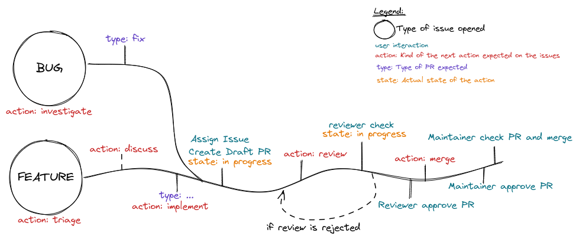

# Contributing

## Workflow

Polyxia is using a workflow to be efficient and preserve the quality of the application and code.

### Submit an issue or pull request

We want to folow a simple and easy way to submit issues or pull requests. The folowing schema is the actual implementation of our flow.



To understand well how we are using labels, refer to this definition for each labels:

- `action: ...` The kind of the next action expected to be achieved on the issue
- `state: ...` The state of the issue (according with the action)
- `type: ...` The type of Pull Request expected to be performed on the issue
- `priority: ...` The priority of treatement of the issue
- `semver: ...` Specific to Pull Request, the kind of version to be released
- We also use some common labels like `breaking changes`, `help wanted` and `good first issue`.

_Using our templates for issues and bug report, labels should be automatically provided._

### Open a Pull Request

When you are creating a pull request, consider using templates provided and fill it.

### Review flow

**Your pull request have to be rebased before asking for merge**

When your Pull Request is ready to be reviewed, you can ask for "review" by adding the label :
`action: review`

This label inform that the Pull Request is ready to be reviewed according to the contributor, the Pull Request will be checked in a first step by a maintainer using the following criterias:

- [ ] Rebased and don't have merge conflict
- [ ] Code explainations and documentation provided
- [ ] Unitary tests or procedure to test the feature provided
- [ ] Pull request have a description of the feature objectives provided

If the maintainer validates the relevance and form of the Pull Request, he will switch the label to `action: merge`.

A Pull Request with `action: merge` need to be reviewed by a maintainer and merged if all OK.

NOTE: A pull request need 2 approvals to be merged.

## Commits conventions

Our commit convention folow the [Conventional Commits 1.0.0-beta.4](https://www.conventionalcommits.org/en/v1.0.0-beta.4/)

To be more explicit, we will describe below the commit conventions message.

### Commit Message Format

Each commit message consists of a header, a body and a footer. The header has a special format that includes a type, a scope and a subject:

```
<type>(<scope>): <subject>
<BLANK LINE>

<body>
<BLANK LINE>
<footer>
```

The header is mandatory and the scope of the header is optional.

Any line of the commit message cannot be longer 100 characters! This allows the message to be easier to read on GitHub as well as in various git tools.

The footer should contain a [closing reference to an issue](https://docs.github.com/en/issues/tracking-your-work-with-issues/linking-a-pull-request-to-an-issue) if any.

Samples: (even more samples)

```
docs(changelog): update changelog to beta.5
```

```
fix(release): need to depend on latest rxjs and zone.js
```

The version in our package.json gets copied to the one we publish, and users need the latest of these.

### Revert

If the commit reverts a previous commit, it should begin with `revert:` , followed by the header of the reverted commit. In the body it should say: `This reverts commit <hash>.`, where the hash is the SHA of the commit being reverted.

### Type
Must be one of the following:

- **build**: Changes that affect the build system or external dependencies (example scopes: npm, maven, etc.)
- **chore**: Some house keeping activity
- **ci**: Changes to our CI configuration files and scripts
- **docs**: Documentation only changes
- **feat**: A new feature
- **fix**: A bug fix
- **perf**: A code change that improves performance
- **refactor**: A code change that neither fixes a bug nor adds a feature
- **revert**: A commit revert
- **style**: Changes that do not affect the meaning of the code (white-space, formatting, missing semi-colons, etc)
- **test**: Adding missing tests or correcting existing tests
- **i18n**: Add or improve translations

### Scope
The scope should be the name of the npm package affected (as perceived by the person reading the changelog generated from commit messages.

The following is the list of supported scopes:

- animations
- common
- compiler
- core
- elements
- security
- [service name]
- etc.

There are currently a few exceptions to the "use package name" rule:

- **packaging**: used for changes that change the npm package layout in all of our packages, e.g. public path changes, package.json changes done to all packages, d.ts file/format changes, changes to bundles, etc.
- **none/empty string**: useful for style, test and refactor changes that are done across all packages (e.g. style: add missing semicolons)

### Subject

The subject contains a succinct description of the change:

- use the imperative, present tense: "change" not "changed" nor "changes"
- don't capitalize the first letter
- no dot (.) at the end

### Body

Just as in the subject, use the imperative, present tense: "change" not "changed" nor "changes". The body should include the motivation for the change and contrast this with previous behavior.

### Footer

The footer should contain any information about Breaking Changes and is also the place to [reference GitHub issues that this commit Closes](https://docs.github.com/en/issues/tracking-your-work-with-issues/linking-a-pull-request-to-an-issue).

**Breaking Changes** should start with the word BREAKING CHANGE: with a space or two newlines. The rest of the commit message is then used for this.

### Sign commit message

Please consider signing the commit message at least with `Signed-Off-By`.
